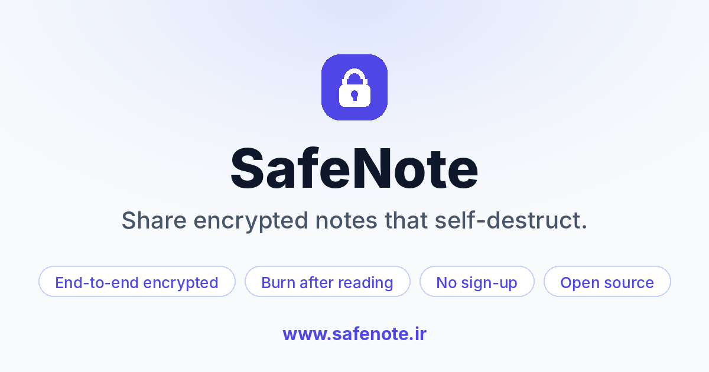
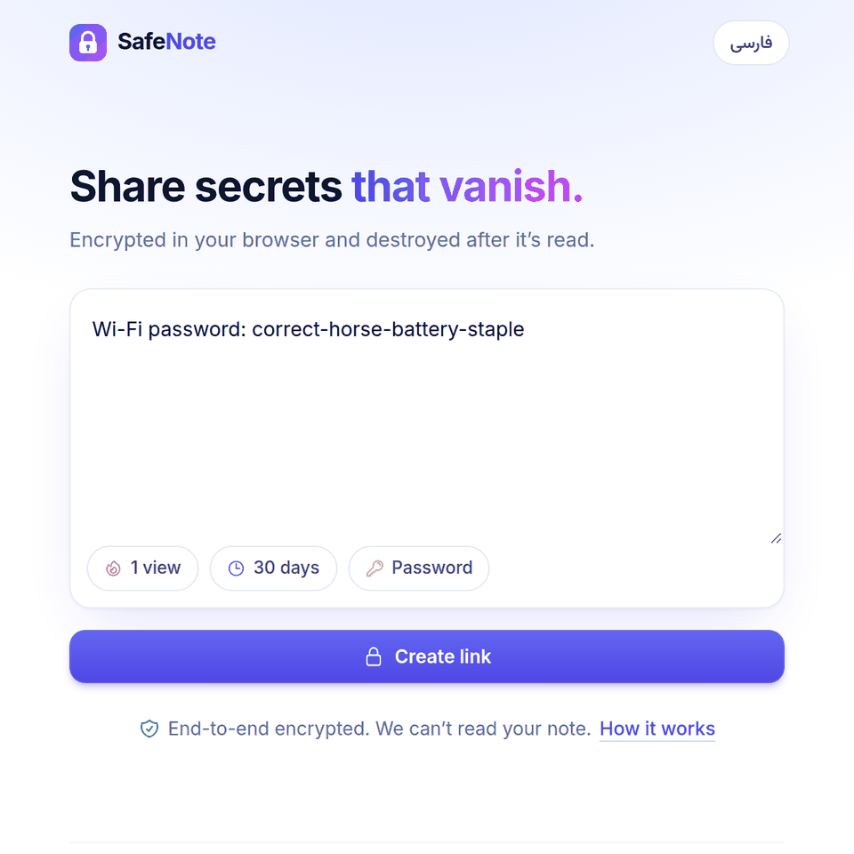
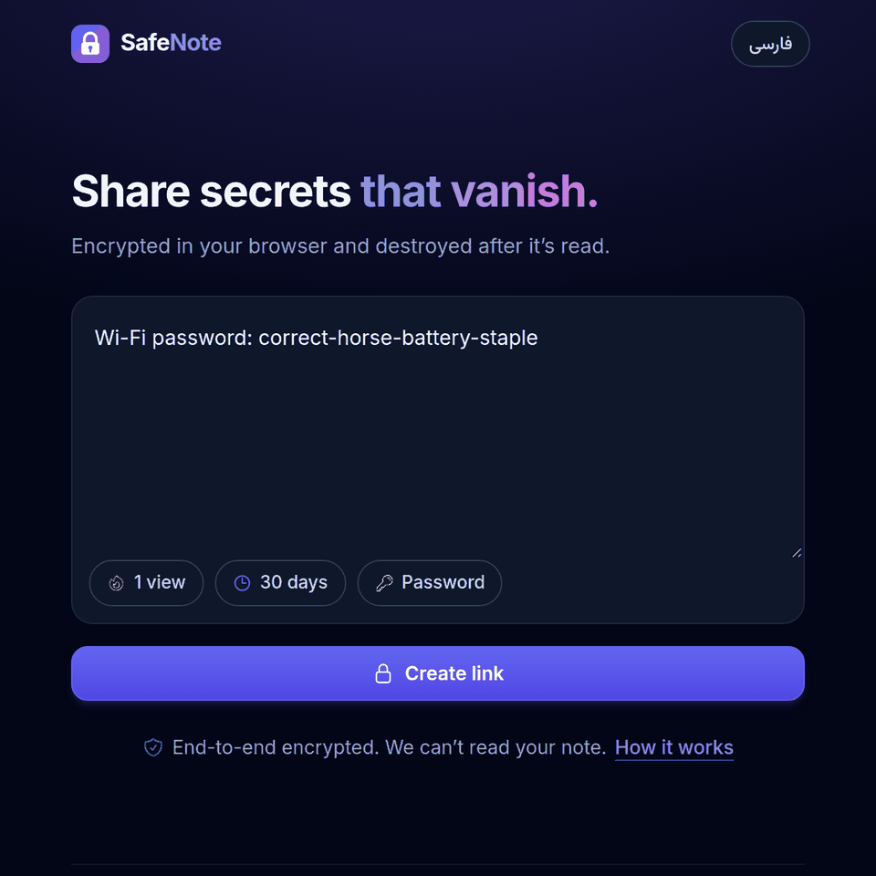
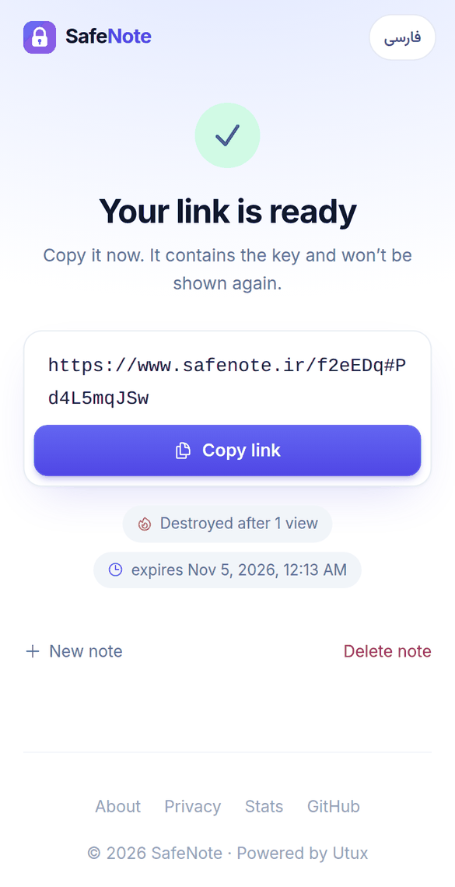
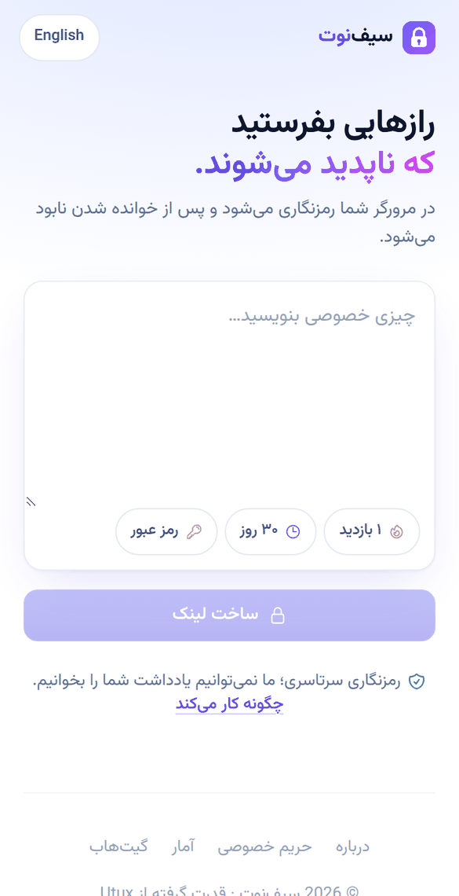

<div align="center">

<a href="https://www.safenote.ir/">
  
</a>

# SafeNote · سیف‌نوت

**Share passwords, keys and secrets through links that vanish after they're read.**<br/>
Notes are encrypted in your browser. The server never sees what you write.

### 🔗 [www.safenote.ir](https://www.safenote.ir/)

[](https://www.safenote.ir/)
[](LICENSE)


[Features](#-features) · [Screenshots](#-screenshots) · [Security model](#-security-model) · [Self-hosting](#-self-hosting) · [Development](#-development) · [فارسی](#-فارسی) · [Roadmap](ROADMAP.md)

</div>

---

## ✨ Features

| | |
|---|---|
| 🔐 **End-to-end encryption** | AES-256-GCM in the browser via the native WebCrypto API. Only ciphertext reaches the server. |
| 🔥 **Self-destructing notes** | Destroyed after 1–10 views or after 1 hour to 30 days, whichever comes first. |
| ✉️ **Short, SMS-friendly links** | `https://safenote.ir/3mAriF#tVVZ9dSIsf`, 37 characters in total. |
| 🔑 **Optional password** | A wrong password is rejected **without** burning the note, so typos are harmless. |
| 🙈 **Zero-knowledge** | The key lives after the `#` in the link, a part browsers never send to servers. |
| 🚫 **No account, no tracking** | No sign-up, analytics, ads, or third-party scripts and fonts. One cookie remembers your language. |
| 🌍 **Bilingual** | English and Persian (فارسی) with native RTL layout, chosen server-side so pages never flash. |
| 📱 **Made for phones** | Minimal single-column design, light and dark themes, large touch targets, no zoom-on-focus. |
| 🛡️ **Hardened** | Strict CSP, `no-referrer`, per-IP rate limits, atomic view counting, `no-store` on note pages. |

## 📸 Screenshots

<table>
  <tr>
    <td width="50%"></td>
    <td width="50%"></td>
  </tr>
  <tr>
    <td align="center"><sub>Write a note. The pills set views, expiry and password.</sub></td>
    <td align="center"><sub>Follows the system dark mode.</sub></td>
  </tr>
</table>

<p align="center">
  
  &nbsp;&nbsp;
  
</p>
<p align="center"><sub>The short link, ready to copy or share · the Persian (RTL) interface</sub></p>

## 🔒 Security model

```
 Sender's browser                       Server                        Recipient's browser
 ─────────────────                      ──────                        ───────────────────
 linkKey = 10 random chars
 salt    = 16 random bytes
 master  = PBKDF2(linkKey ‖ password,
                  salt, 600k rounds)
 encKey, token = HKDF(master)
 ciphertext = AES-256-GCM(note)
      │
      │  POST {ciphertext, salt, token} ──▶  stores ciphertext, salt,
      │                                      SHA-256(token)
      ▼
 share  https://safenote.ir/<id>#<linkKey>  ────────────────────────▶  linkKey ← URL fragment
                                                ◀── GET salt ──────    master, encKey, token
                                                ◀── POST /open {token} (wrong token → 401,
                                                                        no view used)
                                     ciphertext ──▶                    AES-GCM decrypt locally
                                     (view burned; row deleted on the last view)
```

- **Never leaves your device:** the note text, the link key and the password.
- **The server stores:** the ciphertext, its expiry and view count, a random salt, and `SHA-256(token)`. None of these can decrypt a note.
- **Short key, still strong:**
  - The 10-character key (60 bits) is stretched with 600,000 rounds of PBKDF2 and a per-note salt.
  - Someone who stole the whole database would need millions of GPU-years to crack one note.
  - Everyone else can't even get the ciphertext without the key-derived token, and requests are rate-limited.
- **Guessing a note ID gets nothing:** no ciphertext, no burned views, no deletes.
- **Atomic burn:** reading, checking, decrementing and deleting happen in one SQLite transaction. A one-view note can never be read twice.

Implementation: [`frontend/src/lib/crypto.ts`](frontend/src/lib/crypto.ts), with tests in [`frontend/tests/`](frontend/tests/).

## 🏗️ Architecture

```
Browser ──▶ SvelteKit (adapter-node, :3000) ──▶ Go + Fiber API (:8080, internal only) ──▶ SQLite
            · SSR pages, i18n, CSP              · validation, rate limiting
            · /api/* thin proxy                 · atomic view counting, cleanup job
```

| Path | What it is |
|---|---|
| `frontend/src/lib/crypto.ts` | Client-side encryption (WebCrypto) |
| `frontend/src/routes/` | Pages: create `/`, view `/[id]` (and legacy `/n/[id]`), `/about`, `/privacy`, `/admin` (stats) |
| `frontend/src/lib/components/NoteViewer.svelte` | The note page shared by both link formats |
| `frontend/src/routes/api/` | Proxies to the backend via `src/lib/server/backend.ts` |
| `frontend/src/lib/i18n/` | `en.ts` / `fa.ts` dictionaries (type-checked to stay in sync) |
| `backend/internal/api/` | Router, rate limits, HTTP handlers, and tests |
| `backend/internal/repositories/` | SQLite access, migrations, atomic `Consume` |

## 🚀 Self-hosting

**Requirements:** Docker and Docker Compose.

```bash
git clone https://github.com/malekpouri/safenote.ir.git
cd safenote.ir
docker compose up -d --build
```

The app listens on **http://localhost:8081**. Put a TLS-terminating reverse proxy (nginx, Caddy, …) in front of it. The proxy should set `X-Forwarded-For` or `X-Real-IP` so rate limiting sees real client IPs.

| Variable | Service | Default | Purpose |
|---|---|---|---|
| `DB_PATH` | backend | `/data/sqlite.db` | SQLite file (mounted from `./database`) |
| `PORT` | backend | `8080` | Listen port |
| `RATE_LIMIT_CREATE` | backend | `20` | Note creations per minute per IP (`0` = off) |
| `RATE_LIMIT_READ` | backend | `60` | Reads/deletes per minute per IP (`0` = off) |
| `INTERNAL_API_URL` | frontend | `http://backend:8080` | Where the SvelteKit server reaches the API |
| `ORIGIN` | frontend | `https://www.safenote.ir` | Public origin of the site |

> **Upgrading an existing install:** the database is no longer tracked in git. Back it up before pulling: `cp database/sqlite.db ~/sqlite.backup.db`. The schema migrates automatically on start, and existing links keep working until they expire.

## 🧑‍💻 Development

```bash
# Backend (needs a C compiler for go-sqlite3)
cd backend
DB_PATH=./dev.db go run ./cmd/server
go test ./...                       # API + repository tests (add -race for the concurrency test)

# Frontend
cd frontend
npm install
INTERNAL_API_URL=http://localhost:8080 npm run dev
npm run check                       # svelte-check (TypeScript + Svelte)
npm test                            # crypto unit tests (Node ≥ 22.6)
```

Every UI string lives in `frontend/src/lib/i18n/en.ts` and `fa.ts`. The Persian dictionary is typed against the English one, so `npm run check` fails if a key is missing.

---

<div dir="rtl">

## 🇮🇷 فارسی

**سیف‌نوت** سرویسی رایگان و متن‌باز برای ارسال یادداشت‌های محرمانه است. یادداشت‌ها پیش از ارسال **در مرورگر شما** رمزنگاری می‌شوند و پس از خوانده شدن برای همیشه نابود می‌شوند.

🔗 **نشانی سایت: [www.safenote.ir](https://www.safenote.ir/)**

### ویژگی‌ها

- 🔐 **رمزنگاری سرتاسری:** AES-256-GCM با WebCrypto در مرورگر؛ سرور فقط متن رمزشده را می‌بیند.
- 🔥 **خودتخریب:** نابودی پس از ۱ تا ۱۰ بازدید یا پس از ۱ ساعت تا ۳۰ روز.
- ✉️ **لینک کوتاه، مناسب پیامک:** فقط ۳۷ کاراکتر، مانند `https://safenote.ir/3mAriF#tVVZ9dSIsf`.
- 🔑 **رمز عبور اختیاری:** رمز اشتباه یادداشت را نمی‌سوزاند.
- 🙈 **بدون دسترسی سرور:** کلید در بخش `#` لینک است و هرگز به سرور ارسال نمی‌شود.
- 🚫 **بدون ثبت‌نام و ردیابی:** بدون آنالیتیکس، تبلیغات، اسکریپت یا فونت شخص ثالث.
- 🌍 **دوزبانه:** فارسی و انگلیسی با چیدمان راست‌به‌چپ.
- 📱 **مناسب موبایل:** طراحی ساده و تک‌ستونی، حالت روشن و تیره.

### راه‌اندازی

</div>

```bash
git clone https://github.com/malekpouri/safenote.ir.git
cd safenote.ir
docker compose up -d --build
# http://localhost:8081
```

<div dir="rtl">

برای جزئیات بیشتر بخش‌های [مدل امنیتی](#-security-model) و [میزبانی شخصی](#-self-hosting) را ببینید.

</div>

---

## 🤝 Contributing

Issues and pull requests are welcome. See the [roadmap](ROADMAP.md) for planned work. Please run `go test ./...`, `npm run check` and `npm test` before opening a PR.

## 📄 License

[MIT](LICENSE) © SafeNote. Powered by [Utux](https://utux.ir).

<div align="center"><sub><a href="https://www.safenote.ir/">www.safenote.ir</a></sub></div>
